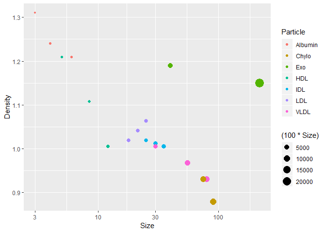

##Load Libraries

```r
library("tidyverse")
```

```
## -- Attaching packages -------------------------------------------------------------------------------------------------------------------------------- tidyverse 1.2.1 --
```

```
## v ggplot2 3.1.0       v purrr   0.2.5  
## v tibble  2.0.1       v dplyr   0.8.0.1
## v tidyr   0.8.2       v stringr 1.3.1  
## v readr   1.3.1       v forcats 0.3.0
```

```
## -- Conflicts ----------------------------------------------------------------------------------------------------------------------------------- tidyverse_conflicts() --
## x dplyr::filter() masks stats::filter()
## x dplyr::lag()    masks stats::lag()
```

```r
library("ggplot2")
library("ggthemr")
library("devtools")
```

```
## Warning: package 'devtools' was built under R version 3.5.3
```

```r
library("skimr")
```

```
## 
## Attaching package: 'skimr'
```

```
## The following object is masked from 'package:stats':
## 
##     filter
```

```r
library("RColorBrewer")
options(scipen = 999)
```


##Load Data

```r
Particle_dim_data <- readr:: read_csv("/Users/user/Desktop/Papers/Particle_Size_Density_Data.csv")

Particle_dim_data
```

```
## # A tibble: 19 x 3
##    Particle  Size Density
##    <chr>    <dbl>   <dbl>
##  1 Albumin    3     1.31 
##  2 Albumin    4     1.24 
##  3 Albumin    6     1.21 
##  4 HDL        5     1.21 
##  5 HDL       12     1.01 
##  6 HDL        8.5   1.11 
##  7 LDL       18     1.02 
##  8 LDL       25     1.06 
##  9 LDL       21.5   1.04 
## 10 IDL       25     1.02 
## 11 IDL       35     1.01 
## 12 IDL       30     1.01 
## 13 VLDL      30     1.01 
## 14 VLDL      80     0.93 
## 15 VLDL      55     0.968
## 16 Chylo     75     0.93 
## 17 Chylo     90     0.88 
## 18 Exo       40     1.19 
## 19 Exo      220     1.15
```


## Generate a Dot Plot, maybe histo?


```r
Particle_dim_data %>%
ggplot(aes(x = Size, y = Density, color = Particle, size = (100*Size)))+
    geom_point()+
#    scale_y_log10()+
   scale_x_log10()
```

<!-- -->

```r
#    scale_size(range = c(0.1, 10), guide = "none")+
#    theme_dark()
```
